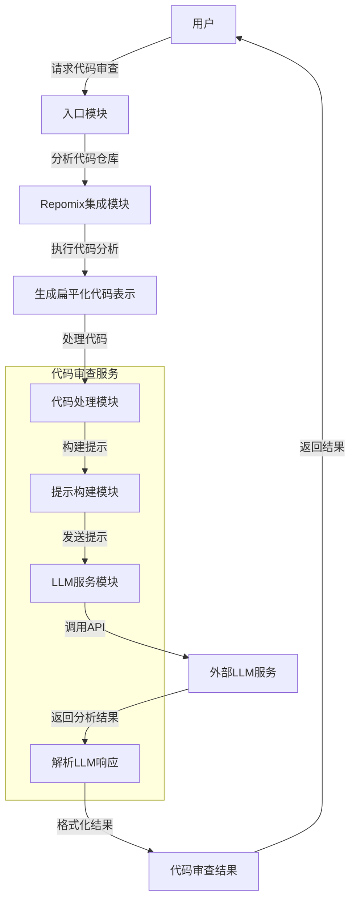

# MCP 代码审查系统分析报告

## 系统概述

MCP 代码审查系统是一个基于大语言模型（LLM）的代码审查工具，它通过集成 Repomix 工具进行代码分析，并利用 LLM 提供智能化的代码审查结果。系统设计为服务器模式和命令行工具两种使用方式，可以对代码仓库或特定文件进行安全性、性能、质量和可维护性方面的审查。

## 系统架构

系统主要由以下几个核心模块组成：

1. **入口模块**：包括服务器入口（index.ts）和命令行工具入口（cli.ts）
2. **Repomix 集成模块**：负责代码分析和扁平化（repomix.ts）
3. **LLM 服务模块**：负责与大语言模型交互（llm/service.ts）
4. **代码审查服务模块**：协调整个审查流程（llm/codeReviewService.ts）
5. **代码处理模块**：处理代码以适应 LLM 输入（llm/processor.ts）
6. **提示构建模块**：构建发送给 LLM 的提示（llm/prompt.ts）

## 系统流程图

## 模块详细分析

### 1. 入口模块

系统提供两种使用方式：

- **服务器模式**（index.ts）：基于 ModelContextProtocol (MCP) SDK 实现，注册了两个工具：
  - `analyze_repo`：分析代码仓库结构
  - `code_review`：执行详细代码审查

- **命令行工具**（cli.ts）：提供命令行界面，支持指定仓库路径、特定文件、文件类型、详细程度和关注领域等参数。

### 2. Repomix 集成模块（repomix.ts）

该模块负责与 Repomix 工具集成，提供以下功能：

- **executeRepomix**：执行 Repomix 分析，支持配置包含路径、排除路径、文件类型等选项
- **sendToLLM**：将 Repomix 输出发送给 LLM 进行代码审查
- **analyzeRepo**：组合上述功能，提供完整的代码仓库分析流程

### 3. LLM 服务模块（llm/service.ts）

该模块负责与不同的 LLM 提供商（OpenAI、Anthropic、Gemini）进行交互：

- 支持不同 LLM 提供商的 API 调用
- 处理 API 响应并转换为统一的代码审查结果格式
- 实现错误处理和重试机制

### 4. 代码审查服务模块（llm/codeReviewService.ts）

该模块是系统的核心，协调整个代码审查流程：

- 初始化 LLM 服务、提示构建器和代码处理器
- 提供从文件或 Repomix 输出进行代码审查的方法
- 实现错误处理和日志记录

### 5. 代码处理模块（llm/processor.ts）

该模块负责处理代码以适应 LLM 的输入要求：

- 处理 Repomix 输出（文件或字符串）
- 格式化代码以提高 LLM 理解能力
- 将大型代码库分割成可管理的块

### 6. 提示构建模块（llm/prompt.ts）

该模块负责构建发送给 LLM 的提示：

- 根据代码审查选项（关注领域、详细程度）构建提示
- 提供清晰的指导，使 LLM 生成结构化的代码审查结果

## 数据流分析

1. **输入数据**：
   - 代码仓库路径或特定文件
   - 代码审查选项（关注领域、详细程度）

2. **中间数据**：
   - Repomix 输出（扁平化的代码表示）
   - LLM 提示（包含代码和审查指导）
   - LLM 响应（JSON 格式的审查结果）

3. **输出数据**：
   - 结构化的代码审查结果（CodeReviewResult）：
     - 代码摘要
     - 问题列表（类型、严重程度、描述、行号、建议）
     - 代码优点列表
     - 整体建议列表

## 配置和扩展性

系统设计具有良好的配置性和扩展性：

1. **LLM 提供商配置**：
   - 支持多种 LLM 提供商（OpenAI、Anthropic、Gemini）
   - 通过环境变量配置 API 密钥和模型

2. **代码审查选项**：
   - 可配置关注领域（安全性、性能、质量、可维护性）
   - 可配置详细程度（基本、详细）

3. **Repomix 选项**：
   - 可配置包含路径、排除路径、文件类型等

## 系统优势

1. **模块化设计**：系统各组件职责明确，便于维护和扩展
2. **多种使用方式**：支持服务器模式和命令行工具
3. **灵活配置**：支持多种 LLM 提供商和丰富的配置选项
4. **错误处理**：实现了完善的错误处理和重试机制
5. **国际化支持**：代码注释同时提供英文和中文

## 潜在改进点

1. **并行处理**：对于大型代码库，可以实现并行处理多个代码块
2. **缓存机制**：实现 LLM 响应缓存，减少重复请求
3. **更多 LLM 提供商**：增加对更多 LLM 提供商的支持
4. **结果可视化**：提供代码审查结果的可视化展示
5. **增量审查**：支持只审查变更的代码部分

## 总结

MCP 代码审查系统是一个功能完善、设计良好的代码审查工具，通过集成 Repomix 和 LLM，提供了智能化的代码审查能力。系统模块化设计使其具有良好的可维护性和扩展性，支持多种使用方式和丰富的配置选项，能够满足不同场景下的代码审查需求。