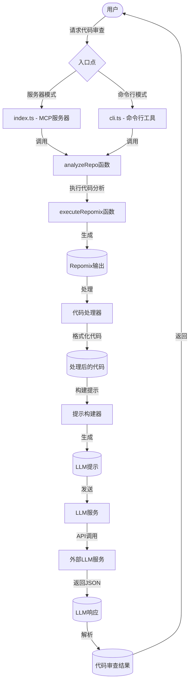
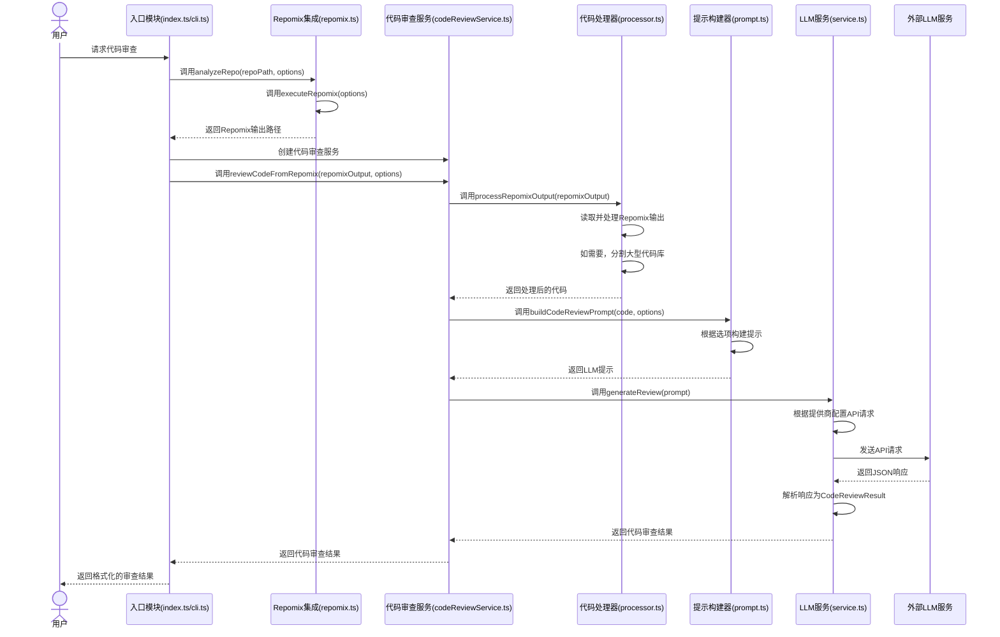
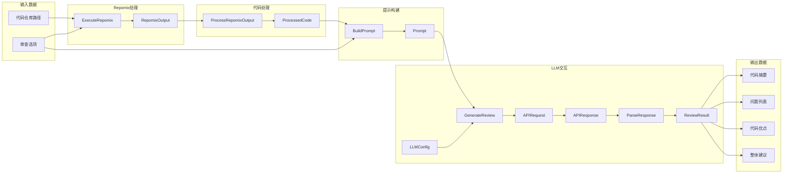
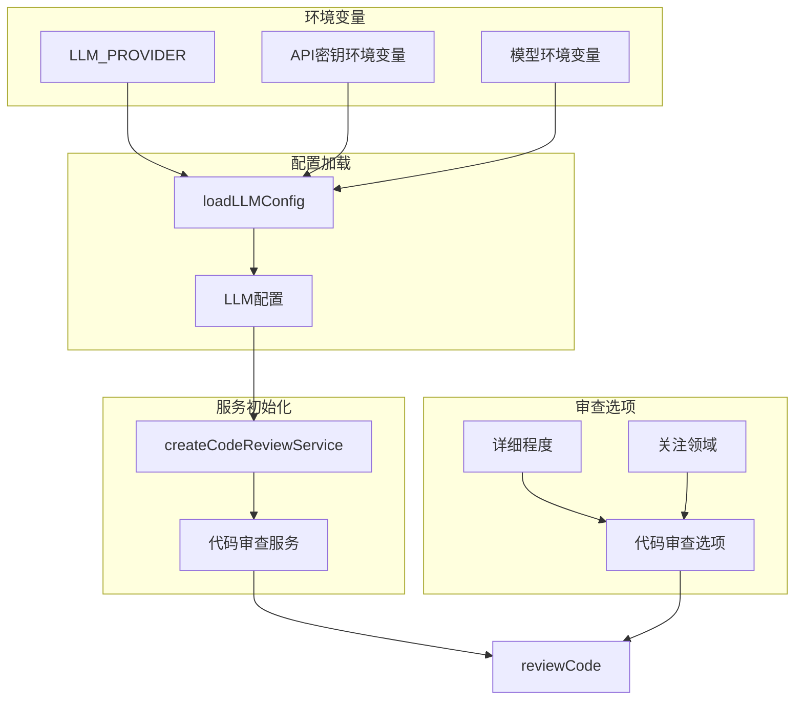
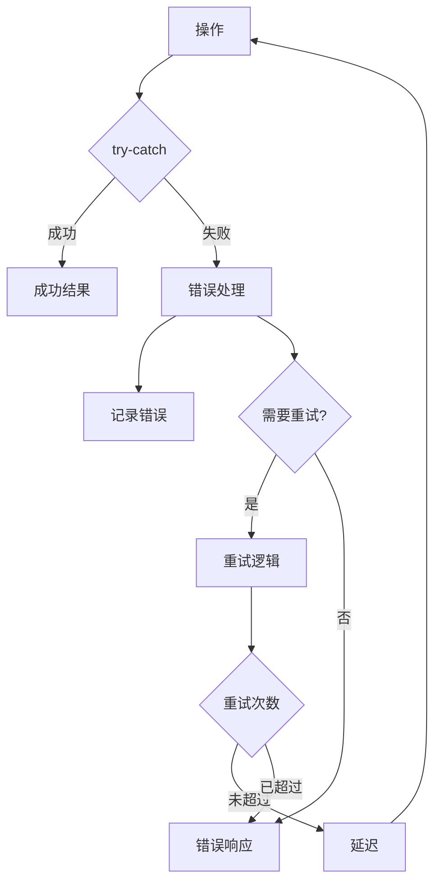
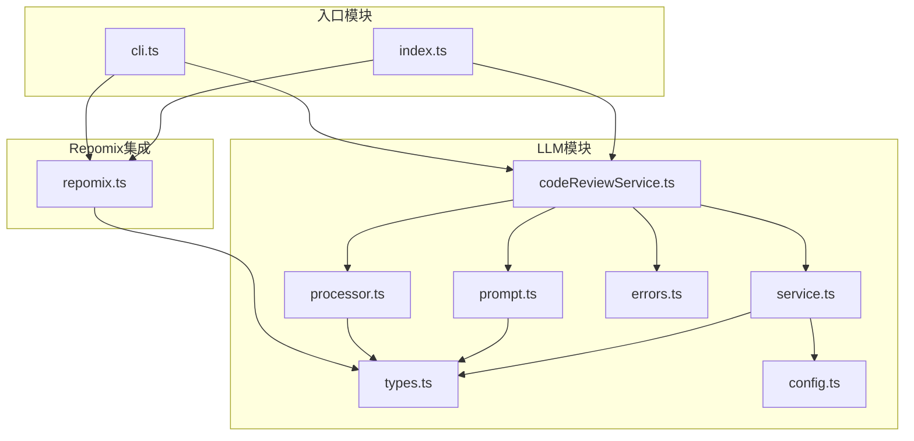

# MCP 代码审查系统流程图

## 系统整体流程

```mermaid
flowchart TD
    User([用户]) -->|请求代码审查| EntryPoint{入口点}
    EntryPoint -->|服务器模式| Server[index.ts - MCP服务器]
    EntryPoint -->|命令行模式| CLI[cli.ts - 命令行工具]
    
    Server -->|调用| AnalyzeRepo[analyzeRepo函数]
    CLI -->|调用| AnalyzeRepo
    
    AnalyzeRepo -->|执行代码分析| ExecuteRepomix[executeRepomix函数]
    ExecuteRepomix -->|生成| RepomixOutput[(Repomix输出)]
    
    RepomixOutput -->|处理| CodeProcessor[代码处理器]
    CodeProcessor -->|格式化代码| ProcessedCode[(处理后的代码)]
    
    ProcessedCode -->|构建提示| PromptBuilder[提示构建器]
    PromptBuilder -->|生成| Prompt[(LLM提示)]
    
    Prompt -->|发送| LLMService[LLM服务]
    LLMService -->|API调用| ExternalLLM[外部LLM服务]
    ExternalLLM -->|返回JSON| LLMResponse[(LLM响应)]
    
    LLMResponse -->|解析| CodeReviewResult[(代码审查结果)]
    CodeReviewResult -->|返回| User
```

## 详细组件交互流程

```mermaid
sequenceDiagram
    actor User as 用户
    participant Entry as 入口模块(index.ts/cli.ts)
    participant Repomix as Repomix集成(repomix.ts)
    participant CRS as 代码审查服务(codeReviewService.ts)
    participant Processor as 代码处理器(processor.ts)
    participant Prompt as 提示构建器(prompt.ts)
    participant LLMSvc as LLM服务(service.ts)
    participant ExternalLLM as 外部LLM服务
    
    User->>Entry: 请求代码审查
    Entry->>Repomix: 调用analyzeRepo(repoPath, options)
    Repomix->>Repomix: 调用executeRepomix(options)
    Repomix-->>Entry: 返回Repomix输出路径
    
    Entry->>CRS: 创建代码审查服务
    Entry->>CRS: 调用reviewCodeFromRepomix(repomixOutput, options)
    
    CRS->>Processor: 调用processRepomixOutput(repomixOutput)
    Processor->>Processor: 读取并处理Repomix输出
    Processor->>Processor: 如需要，分割大型代码库
    Processor-->>CRS: 返回处理后的代码
    
    CRS->>Prompt: 调用buildCodeReviewPrompt(code, options)
    Prompt->>Prompt: 根据选项构建提示
    Prompt-->>CRS: 返回LLM提示
    
    CRS->>LLMSvc: 调用generateReview(prompt)
    LLMSvc->>LLMSvc: 根据提供商配置API请求
    LLMSvc->>ExternalLLM: 发送API请求
    ExternalLLM-->>LLMSvc: 返回JSON响应
    LLMSvc->>LLMSvc: 解析响应为CodeReviewResult
    LLMSvc-->>CRS: 返回代码审查结果
    
    CRS-->>Entry: 返回代码审查结果
    Entry-->>User: 返回格式化的审查结果
```

## 数据流程图

```mermaid
flowchart LR
    subgraph 输入数据
        RepoPath[代码仓库路径]
        Options[审查选项]
    end
    
    subgraph Repomix处理
        RepoPath --> ExecuteRepomix
        Options --> ExecuteRepomix
        ExecuteRepomix --> RepomixOutput
    end
    
    subgraph 代码处理
        RepomixOutput --> ProcessRepomixOutput
        ProcessRepomixOutput --> ProcessedCode
    end
    
    subgraph 提示构建
        ProcessedCode --> BuildPrompt
        Options --> BuildPrompt
        BuildPrompt --> Prompt
    end
    
    subgraph LLM交互
        Prompt --> GenerateReview
        LLMConfig --> GenerateReview
        GenerateReview --> APIRequest
        APIRequest --> APIResponse
        APIResponse --> ParseResponse
        ParseResponse --> ReviewResult
    end
    
    subgraph 输出数据
        ReviewResult --> Summary[代码摘要]
        ReviewResult --> Issues[问题列表]
        ReviewResult --> Strengths[代码优点]
        ReviewResult --> Recommendations[整体建议]
    end
```

## 配置流程图

```mermaid
flowchart TD
    subgraph 环境变量
        LLMProvider[LLM_PROVIDER]
        APIKey[API密钥环境变量]
        ModelEnv[模型环境变量]
    end
    
    subgraph 配置加载
        LLMProvider --> LoadConfig[loadLLMConfig]
        APIKey --> LoadConfig
        ModelEnv --> LoadConfig
        LoadConfig --> Config[LLM配置]
    end
    
    subgraph 服务初始化
        Config --> CreateService[createCodeReviewService]
        CreateService --> Service[代码审查服务]
    end
    
    subgraph 审查选项
        DetailLevel[详细程度]
        FocusAreas[关注领域]
        DetailLevel --> ReviewOptions[代码审查选项]
        FocusAreas --> ReviewOptions
    end
    
    Service --> ReviewCode[reviewCode]
    ReviewOptions --> ReviewCode
```

## 错误处理流程

```mermaid
flowchart TD
    Operation[操作] --> TryCatch{try-catch}
    TryCatch -->|成功| Success[成功结果]
    TryCatch -->|失败| ErrorHandler[错误处理]
    
    ErrorHandler --> LogError[记录错误]
    ErrorHandler --> RetryMechanism{需要重试?}
    RetryMechanism -->|是| Retry[重试逻辑]
    RetryMechanism -->|否| ErrorResponse[错误响应]
    
    Retry --> RetryCount{重试次数}
    RetryCount -->|未超过| Delay[延迟]
    Delay --> Operation
    RetryCount -->|已超过| ErrorResponse
```

## 组件依赖关系

```mermaid
flowchart TD
    subgraph 入口模块
        Index[index.ts]
        CLI[cli.ts]
    end
    
    subgraph Repomix集成
        RepomixModule[repomix.ts]
    end
    
    subgraph LLM模块
        CodeReviewService[codeReviewService.ts]
        LLMService[service.ts]
        PromptBuilder[prompt.ts]
        CodeProcessor[processor.ts]
        ErrorHandler[errors.ts]
        Types[types.ts]
        Config[config.ts]
    end
    
    Index --> RepomixModule
    Index --> CodeReviewService
    CLI --> RepomixModule
    CLI --> CodeReviewService
    
    CodeReviewService --> LLMService
    CodeReviewService --> PromptBuilder
    CodeReviewService --> CodeProcessor
    CodeReviewService --> ErrorHandler
    
    LLMService --> Types
    PromptBuilder --> Types
    CodeProcessor --> Types
    LLMService --> Config
    
    RepomixModule --> Types
```